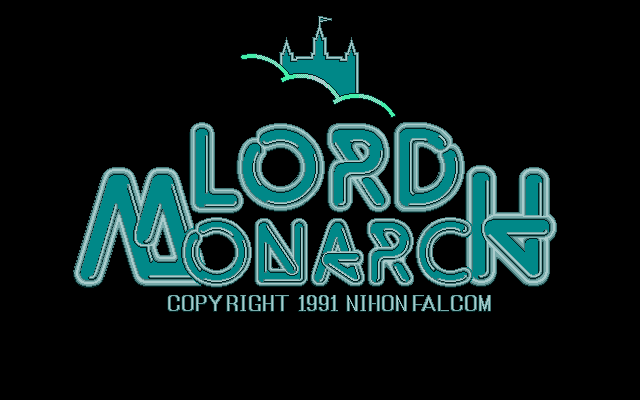
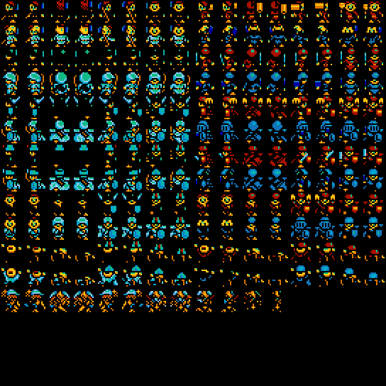
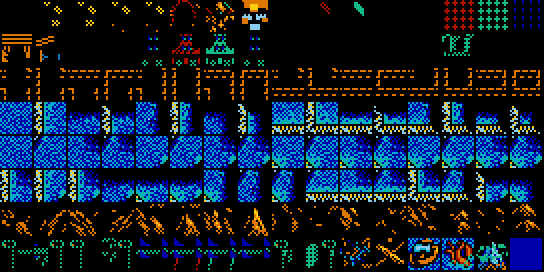
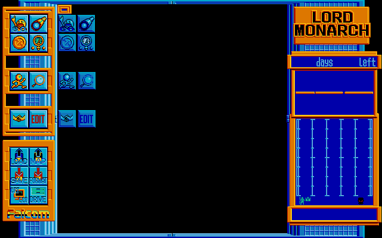

# Lord Monarch (PC-98) — 解析と C 移植（作業中）

日本ファルコムの PC-98 用 **ロードモナーク**（1991）の体験版フロッピーを
Ghidra で解析して C 言語に書き直し、最終的に WASM で動かすためのリポジトリです。

**PC-98 のオリジナル版**が対象です。1997 年の Windows 版（別リポジトリ:
https://github.com/yomei-o/loadmonarch_wasm ）とはキャラクターも中身も別物で、
そちらから流用しているのは**展開コーデックだけ**です。

同じやり方で移植した先行作:

* [windepth_wasm](https://github.com/yomei-o/windepth_wasm) — WinDepth (Windows)
* [super_depth_wasm](https://github.com/yomei-o/super_depth_wasm) — Super Depth (PC-98)

**現状はまだ解析段階で、動くものはありません。**

## フロッピーの中身

`orig/` に配布アーカイブと展開した `.FIM` イメージが入っています。
`[FIM]` は **256 バイトのヘッダ + PC-98 2HD の生セクタ**で、中身は FAT12
（1024 バイト/セクタ、1232 セクタ、2 面 × 77 シリンダ × 8 セクタ）です。

```sh
python tools/fat12.py orig/*.FIM disk    # -> disk/ に 180 ファイル
```

| ファイル | 中身 |
|---|---|
| `PROG.BIN` 42,040 | 本体。**MZ ヘッダの無い生バイナリ** |
| `PROG.DAT` 8,020 | データ（BZ ではない別形式） |
| `*.MAP` 52 個 | マップ |
| `*.CH4` 40 個 | タイルバンク |
| `*.B1` `*.R1` `*.G1` `*.E1` 59 個 | 640×400 の 4 プレーン画像（タイトル・枠・エンディング） |
| `FM0nn.DAT` 20 個 | FM 音源データ |
| `C_MOJI.DAT` `C_ICON.DAT` | フォントとアイコン |

ディスクは **DOS を経由せず自前のブートセクタから起動**します（`IO.SYS` と
`MSDOS.SYS` は 0 バイトのダミー）。ブートセクタを逆アセンブルすると、
`INT 1Bh` でルートディレクトリを 192 エントリ走査して

* `PROG.DAT` を `0000:1000` へ
* `PROG.BIN` を `1000:0000` へ

読み込み、`ljmp 0x1000:0` で飛んでいます。つまり **`PROG.BIN` のロード番地は
セグメント 0x1000、エントリはオフセット 0**。

さらに `PROG.BIN` は先頭で `xor sp,sp / mov ds,sp / mov es,sp / mov ss,sp` を
やるので、**CS = 0x1000 なのに DS = 0** です。コード中の `[0x1234]` は
すべて linear の低位メモリで、このファイルのオフセットではありません
（PC-98 の BIOS ワーク `[0x584]` などを実際に読んでいることで裏付けました）。

## グラフィック

すべてファルコム自前の LZ（`.BZ` コーデック）で圧縮されています。
Windows 版のために書いたデコーダがそのまま通ることを**実測**しました。

```
B_000.MAP   1175 -> 2306    Windows 版の .MAP と同じ 0x902 バイト
B_010S.CH4  2721 -> 4640    145 タイル × 8×8 × 4 プレーン
B_010M.CH4  7622 -> 16384   128 タイル × 16×16 × 4 プレーン
C_010M.CH4       -> 32768   256 タイル × 16×16
WAKU.B1     3344 -> 32000   640 × 400 / 8 = ちょうど 1 プレーン
```

`.CH4` は 4 プレーンのタイルバンク（1 タイルにつきプレーン 0,1,2,3 の順）。
`.B1/.R1/.G1/.E1` は 640×400 画面のビットプレーン 4 枚で、PC-98 は
パレット番号を `(E<<3)|(G<<2)|(R<<1)|B` で作るので拡張子の順がそのままビット順です。

```sh
python tools/ch4.py disk/C_010M.CH4 tmp/c010m.png --zoom 2      # タイルバンク
python tools/ch4.py disk/B_010S.CH4 tmp/b010s.png --tile 8      # 8x8 のバンク
python tools/ch4.py disk/DS7TTL     tmp/title.png  --screen     # 4 プレーン画像
```

| | |
|---|---|
|  | `DS7TTL` — タイトル画面 |
|  | `C_010M.CH4` — 4 勢力のキャラクター |
|  | `B_010M.CH4` — 地形タイル |

### パレット

ハードウェアの扱い方は `PROG.BIN` 0x5db7 から**厳密に取れています** —
生きているパレット表は `DS:0x3e20` に 48 バイト、**1 色 3 バイトで順序は
B, R, G**（ポート 0xae → 0xac → 0xaa）、値は `((byte & 0x0f) + 1) * fade >> 8`
で `fade` は `DS:0x34d6`。表の配列は `DS:0x249b` の 0x30 刻みです。

**表の中身の出所はまだ分かっていません。**`PROG.DAT` / `PROG.BIN` の全オフセット、
180 ファイルの生と展開後、フェード値 150〜255 の総当たり、ニブル詰め 24 バイト
形式まで探して見つからず、実行時に組み立てられていると分かっただけです。

そこで現状の色は**実機スクリーンショット（`ss0.jpg` / `ss3.jpg`）からの実測値**を
使っています。同じパレット番号が横に 6 px 以上続く場所の中心画素だけを取って
中央値を出す、という測り方です（JPEG のにじみで細線が潰れるため）。

| | |
|---|---|
|  | `WAKU` — ゲーム画面の枠。index 8 がオレンジ、6 が黄、1 が青 |

タイトルロゴは index 3 のエメラルドグリーン `R0 G8 B8`。

## ツール

先行の 2 作から流用したもの（`tools/lzh.py` は super_depth 由来、
BZ デコーダは Windows 版 Lord Monarch 由来）と、この作業で足したものです。

| | |
|---|---|
| `tools/lzh.py` | LZH 展開（`-lh0/5/6/7-`、ヘッダレベル 0/1/2） |
| `tools/fat12.py` | PC-98 フロッピーイメージ（raw / FIM / FDI / HDM）から FAT12 を取り出す |
| `tools/ch4.py` | `.CH4` タイルバンクと 4 プレーン画像を PNG に |
| `tools/lmdis.py` | `PROG.BIN` 用の再帰下降 16bit 逆アセンブラ・call 元検索 |
| `tools/ghidra_scripts/` | 全関数を C に落とす headless スクリプト |

## これから

1. ~~フロッピーからファイルを取り出す~~ 済
2. ~~グラフィックのフォーマット~~ 済（BZ + 4 プレーン）
3. `PROG.BIN` の解析（進行中）。Ghidra に `x86:LE:16:Real Mode`・ベース
   `1000:0` の生バイナリとして読ませる
4. ~~パレットの形式と番地~~ 済（中身の出所だけ未解明）
5. `.MAP` と `.CH4` の対応を確定して地図を絵にする
6. ゲームロジックの解析と C への書き直し
7. ネイティブ（Win32・640×400 8bpp DIB）
8. WASM（ソフトウェア描画のみ、WebGL 不使用）

解析でわかったことは [RESUME.md](RESUME.md) に足していきます。

## 権利について

ロードモナークの体験版は、当時パソコン通信や雑誌の付録で無償配布されていた
ものです。著作権は **日本ファルコム** にあります。`orig/` には入手した配布
アーカイブをそのまま、`disk/` にはその中身を展開したものを入れてあります。
このリポジトリのツールと、これから書く C ソースは解析して書き直したものです。
`ss0.jpg` と `ss3.jpg` は色を突き合わせるための実機スクリーンショットです。
