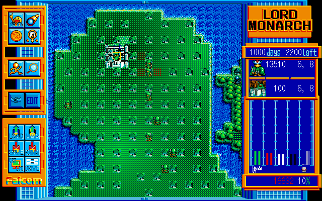
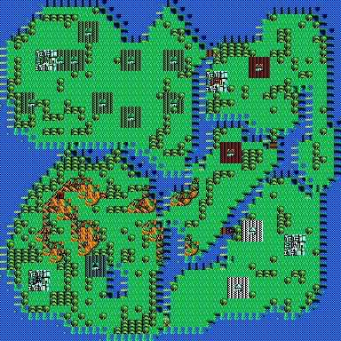
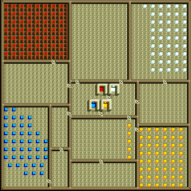
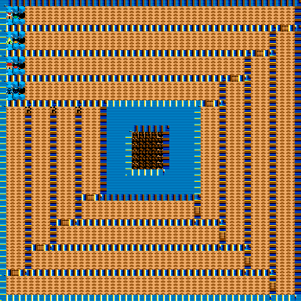
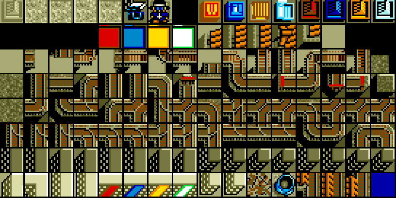
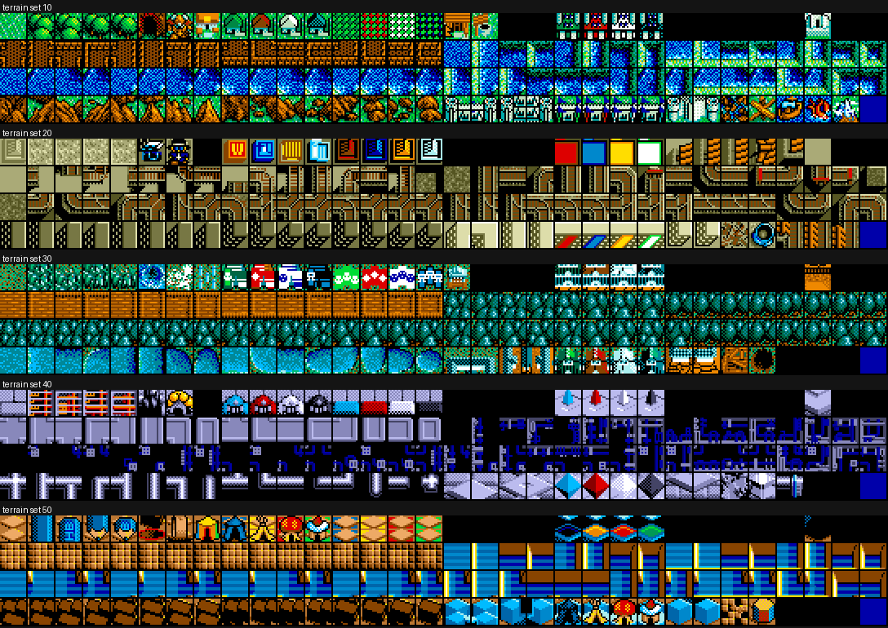

# Lord Monarch (PC-98) — 解析と C 移植（作業中）

日本ファルコムの PC-98 用 **ロードモナーク**（1991）の体験版フロッピーを
Ghidra で解析して C 言語に書き直し、最終的に WASM で動かすためのリポジトリです。

**PC-98 のオリジナル版**が対象です。1997 年の Windows 版（別リポジトリ:
https://github.com/yomei-o/loadmonarch_wasm ）とはキャラクターも中身も別物で、
そちらから流用しているのは**展開コーデックだけ**です。

同じやり方で移植した先行作:

* [windepth_wasm](https://github.com/yomei-o/windepth_wasm) — WinDepth (Windows)
* [super_depth_wasm](https://github.com/yomei-o/super_depth_wasm) — Super Depth (PC-98)

**動きます。** ブラウザで遊べて、**音も鳴ります**:

<https://yomei-o.github.io/lord_monarch_wasm/>

キーボードだけで完結します（矢印でカーソル、スペースで決定、Backspace で取消、
`[` `]` でマップ選択、T でタイトル）。曲はディスクの `FM0nn.DAT` を
`src/opn.c` の YM2203 で鳴らしています ―― 効果音の SSG だけでなく、
**FM 3ch ＋ SSG 3ch** の本物の演奏です。



右のパネルは全部ゲーム自身の数字です ―― 日数と残り日数、カーソルの下の兵
（顔・運搬量・座標・状態名）とマス（32×32 の絵・量・座標）、5 国の領地と
城主の持ち高のグラフ、資金と税率。

**52 面を通して遊べます。** 国を滅ぼすとその国のウィンドウが出て、答えると
そのまま続きが動きます。面をクリアすると次の面に進みます ―― どちらも原作の
`sub_b197` / `sub_b2f2` / `sub_6315` をそのまま追ったものです。

ただし**まだ全部ではありません**。昇格の演出とエンディングの劇、それに
残り日数が 0 になったときの終わりが残っています。何が入っていて何が
残っているかは `RESUME.md` の頭にあります。

## フロッピーの中身

`orig/` に配布アーカイブと展開した `.FIM` イメージが入っています。
`[FIM]` は **256 バイトのヘッダ + PC-98 2HD の生セクタ**で、中身は FAT12
（1024 バイト/セクタ、1232 セクタ、2 面 × 77 シリンダ × 8 セクタ）です。

```sh
python tools/fat12.py orig/*.FIM disk    # -> disk/ に 180 ファイル
```

| ファイル | 中身 |
|---|---|
| `PROG.BIN` 42,040 | 本体。**MZ ヘッダの無い生バイナリ** |
| `PROG.DAT` 8,020 | データ（BZ ではない別形式） |
| `*.MAP` 52 個 | マップ |
| `*.CH4` 40 個 | タイルバンク |
| `*.B1` `*.R1` `*.G1` `*.E1` 59 個 | 640×400 の 4 プレーン画像（タイトル・枠・エンディング） |
| `FM0nn.DAT` 20 個 | FM 音源データ |
| `C_MOJI.DAT` `C_ICON.DAT` | フォントとアイコン |

ディスクは **DOS を経由せず自前のブートセクタから起動**します（`IO.SYS` と
`MSDOS.SYS` は 0 バイトのダミー）。ブートセクタを逆アセンブルすると、
`INT 1Bh` でルートディレクトリを 192 エントリ走査して

* `PROG.DAT` を `0000:1000` へ
* `PROG.BIN` を `1000:0000` へ

読み込み、`ljmp 0x1000:0` で飛んでいます。つまり **`PROG.BIN` のロード番地は
セグメント 0x1000、エントリはオフセット 0**。

さらに `PROG.BIN` は先頭で `xor sp,sp / mov ds,sp / mov es,sp / mov ss,sp` を
やるので、**CS = 0x1000 なのに DS = 0** です。コード中の `[0x1234]` は
すべて linear の低位メモリで、このファイルのオフセットではありません
（PC-98 の BIOS ワーク `[0x584]` などを実際に読んでいることで裏付けました）。

## グラフィック

すべてファルコム自前の LZ（`.BZ` コーデック）で圧縮されています。
Windows 版のために書いたデコーダがそのまま通ることを**実測**しました。

```
B_000.MAP   1175 -> 2306    Windows 版の .MAP と同じ 0x902 バイト
B_010S.CH4  2721 -> 4640    145 タイル × 8×8 × 4 プレーン
B_010M.CH4  7622 -> 16384   128 タイル × 16×16 × 4 プレーン
C_010M.CH4       -> 32768   256 タイル × 16×16
WAKU.B1     3344 -> 32000   640 × 400 / 8 = ちょうど 1 プレーン
```

`.CH4` は 4 プレーンのタイルバンク（1 タイルにつきプレーン 0,1,2,3 の順）。
`.B1/.R1/.G1/.E1` は 640×400 画面のビットプレーン 4 枚で、PC-98 は
パレット番号を `(E<<3)|(G<<2)|(R<<1)|B` で作るので拡張子の順がそのままビット順です。

```sh
python tools/ch4.py disk/C_010M.CH4 tmp/c010m.png --zoom 2      # タイルバンク
python tools/ch4.py disk/B_010S.CH4 tmp/b010s.png --tile 8      # 8x8 のバンク
python tools/ch4.py disk/DS7TTL     tmp/title.png  --screen     # 4 プレーン画像
```

| | |
|---|---|
|  | `DS7TTL` — タイトル画面 |
|  | `C_010M.CH4` — 4 勢力のキャラクター |
|  | `B_010M.CH4` — 地形タイル |

### パレット — 出所判明

ハードウェアの扱い方は `PROG.BIN` 0x5db7 から取れます。生きているパレット表は
`DS:0x3e20` に 48 バイト、**1 色 3 バイトで順序は B, R, G**（ポート
0xae → 0xac → 0xaa）、値は `((byte & 0x0f) + 1) * fade >> 8` で `fade` は
`DS:0x34d6`。RAM 上の表の配列は `DS:0x249b` の 0x30 刻みです。

**表の中身はディスク上、32×32 の地形バンクの末尾にあります。**
`B_0n0L.CH4` はどれも展開すると 32816 バイト = 64 タイル × 32×32 × 4 プレーン
（32768）＋ **48 バイト**で、この 48 バイトがパレットです。しかも
パックされておらず素の 0〜15 の値なので、`PROG.BIN` / `PROG.DAT` を
いくら探しても見つからなかったわけです（ゲームはタイルセットと一緒に
ディスクから読んで `DS:0x249b` に写している）。

index 0〜9 は 5 セットすべて同一 — インターフェイスの色 — で、
**10〜15 が地形セットごとに変わります**。これが同じマップを草原にも
電車の国にも鉛筆王国にも見せている仕組みです。

```
0..9  共通   000 00A D00 AEE 0D3 0BF FD0 FFF E80 08C      (R,G,B の 4bit)
10..15 セット10  840 888 084 0AA BDB CCC   草原
       セット20  840 AA7 DDA 774 552 BBB   文房具（鉛筆王国）
       セット30  840 0B7 064 089 B60 999
       セット40  800 446 007 88B BBE 888
       セット50  B73 840 095 06A EA6 999
```

独立な 3 通りの照合が全部一致しました — index 8 = `E80` は製品版の枠から
実測した (13,7,0) と、index 7 = `FFF` は `org45.gif` の `#efefef` と、
index 1/2/3/5/6/9 も同様に。

タイトル画面 (`DS7TTL`) には地形バンクが無いので、その表だけはまだ
**実測値**です（`tools/ch4.py` に測り方を書いてあります）。

## マップ

`.MAP` は展開すると 2306 バイトで、**48 × 48 セル（1 セル 1 バイト）＋
末尾の `uint16`** です。行幅 48 は、行間の平均差分が最小になる幅を総当たりで
探して決めました（48 が 12.6、次点の 49 が 17.5、96 が第 2 高調波として出る）。

末尾の `uint16` は**地形セット番号**で、52 本すべてが 10 / 20 / 30 / 40 / 50 の
どれかを持ち、これがそのままディスク上の 5 組の
`B_010* B_020* B_030* B_040* B_050*` に対応します（12+10+10+10+10 = 52）。
つまりマップは自分のタイルセットを自分で持っています。

セルの値はバンク内のタイル番号です。`B_nnnS/M/L` は同じ地形セットの
8×8 / 16×16 / 32×32 なので、同じマップが 3 段のズームで描けます。
全 52 本で一番多いセル値は `0x00` = 草地（全体の 33%）、`0x30` 台が水面です。

```sh
python tools/map.py disk/B_000.MAP docs/map.png            # 8x8、バンクは自動選択
python tools/map.py disk/B_009.MAP tmp/m09.png --tile 16    # 16x16
```

| | |
|---|---|
|  | `B_000.MAP` — 地形セット 10（ふつうの草原） |
|  | `B_005.MAP` — 地形セット 20。**電車の国**。道が線路になっている |
|  | セット 20 のタイル。線路・分岐・転車台 |
|  | `B_014.MAP` — 地形セット 50。**鉛筆王国** |
|  | セット 50 のタイル。「HB」と書かれた鉛筆、六角形の鉛筆の束、青い罫線ノート、消しゴム、鉛筆削り |

地形セットは 5 組あり、それぞれ世界のテーマが違います。

| セット | テーマ |
|---|---|
| 10 | 草原・森・山・海。ふつうの世界 |
| 20 | **電車の国**。線路が道になっている |
| 30 | 森と煉瓦の村 |
| 40 | 氷と青いパイプ・結晶の国 |
| 50 | **鉛筆王国**。鉛筆・罫線ノート・消しゴム・鉛筆削り |



## ネイティブビルド

`src/` が移植そのものです。ゲームの規則も音も入っています。

**`make` はこのマシンには無く、Makefile は説明として置いてあるだけです。**
実際に動くのは次の 3 本:

```sh
sh tools/build.sh          # native ＋ wasm（native / wasm を付ければ片方だけ）
sh tools/check.sh          # build してから 5 本の検査を回す
bash tools/shots.sh        # tmp/shots/ に確認用の PNG を並べる
```

検査は `game_check`（規則を逆アセンブルと突き合わせる）、`app_check`
（1 面を実際に勝たせてウィンドウの作法と面の進行を見る）、`sound_check`、
`wasm_check`、`page_check` の 5 本です。

| | |
|---|---|
| `src/disk.c` | FIM / FDI / raw のヘッダ長を総当たりで判別して FAT12 を読む。**原作と同じでファイル名で読む**ので、アセットを別に固める工程が要らない |
| `src/bz.c` | ファルコムの `.BZ` 展開器（Windows 版のために書いたもの。コーデックだけ流用） |
| `src/gfx.c` | 640×400 のパレット番号フレームバッファ。4 プレーンの組み立て、`.CH4` タイルバンク、`.MAP` 描画、地形バンク末尾からのパレット |
| `src/png.c` | 依存なしの PNG 出力（deflate は stored のみ） |
| `src/main_shot.c` | **ウィンドウを開かずに** 1 画面描いて PNG にするコンソールツール |
| `src/main_win32.c` | Win32 ホスト。8bpp DIB + `StretchDIBits` で 2 倍表示 |

```sh
tmp/monarch_shot.exe orig/*.FIM title tmp/title.png
tmp/monarch_shot.exe orig/*.FIM map   B_014.MAP tmp/map.png --tile 16
tmp/monarch_shot.exe orig/*.FIM game  B_005.MAP tmp/game.png
```

`monarch_shot` の出力は `tools/map.py` の出力と**バイト単位で一致**します
（FAT12・BZ・プレーン組み立て・タイル・マップ・パレット・PNG の全経路を
Python 実装と突き合わせて確認）。

枠の中の地図ウィンドウは、`WAKU` でほぼ全高が空いている列が x = 160..479、
行が y = 8..391 なので **320 × 384**。16×16 タイルなら 20 × 24 セル分で、
48 × 48 のマップに対してスクロールする窓になります。

## WASM（ブラウザ）

```sh
make wasm      # monarch.js と monarch.wasm をリポジトリのルートに
```

GitHub Pages はリポジトリのルートを配信するので、`index.html` と
`monarch.js` と `monarch.wasm` はルートに置いてあります。
<https://yomei-o.github.io/lord_monarch_wasm/>

* **WebGL は使いません。** C 側で 640×400 の RGBA に描いて `putImageData`
  するだけです
* フロッピーイメージは `--embed-file` で焼き込んでいるので、ページは
  `index.html` + `monarch.js` + `monarch.wasm` の 3 ファイルだけです。
  ディスクの読み出しはネイティブ版と同じ C コードです

検証はブラウザを開かずにやっています。

```sh
node tests/wasm_check.js    # WASM を node で動かして生フレームを吐く
node tests/page_check.js    # index.html のスクリプトを DOM スタブ上で実行
```

`monarch_shot view` は `app.c` を通るので、ホストの違いを除いた同じ経路です。
**WASM が吐いたフレームとネイティブが吐いた PNG はバイト単位で一致**します
（タイトル・地形セット 10・地形セット 50 の 3 枚で確認）。

## ツール

先行の 2 作から流用したもの（`tools/lzh.py` は super_depth 由来、
BZ デコーダは Windows 版 Lord Monarch 由来）と、この作業で足したものです。

| | |
|---|---|
| `tools/lzh.py` | LZH 展開（`-lh0/5/6/7-`、ヘッダレベル 0/1/2） |
| `tools/fat12.py` | PC-98 フロッピーイメージ（raw / FIM / FDI / HDM）から FAT12 を取り出す |
| `tools/ch4.py` | `.CH4` タイルバンクと 4 プレーン画像を PNG に |
| `tools/lmdis.py` | `PROG.BIN` 用の再帰下降 16bit 逆アセンブラ・call 元検索 |
| `tools/ghidra_scripts/` | 全関数を C に落とす headless スクリプト |

## これから

1. ~~フロッピーからファイルを取り出す~~ 済
2. ~~グラフィックのフォーマット~~ 済（BZ + 4 プレーン）
3. ~~`PROG.BIN` の解析~~ 済（`tools/lmdis.py` が 94.8% を追える）
4. ~~パレットの形式と番地~~ 済（中身の出所だけ未解明）
5. ~~`.MAP` と `.CH4` の対応~~ 済
6. ~~ゲームロジックの解析と C への書き直し~~ 済（規則・音・決着・面の進行）
7. ~~ネイティブ（Win32・640×400 8bpp DIB）~~ 済
8. ~~WASM（ソフトウェア描画のみ、WebGL 不使用）~~ 済
9. 昇格の演出（`sub_b58f`）、エンディングの劇（`sub_ca4a`）、
   残り日数が 0 になったときの終わり、EDIT モード（`sub_2368`）

解析でわかったことは [RESUME.md](RESUME.md) に足していきます。

## 権利について

ロードモナークの体験版は、当時パソコン通信や雑誌の付録で無償配布されていた
ものです。著作権は **日本ファルコム** にあります。`orig/` には入手した配布
アーカイブをそのまま、`disk/` にはその中身を展開したものを入れてあります。
このリポジトリのツールと、これから書く C ソースは解析して書き直したものです。
`ss0.jpg` と `ss3.jpg` は色を突き合わせるための実機スクリーンショットです。
